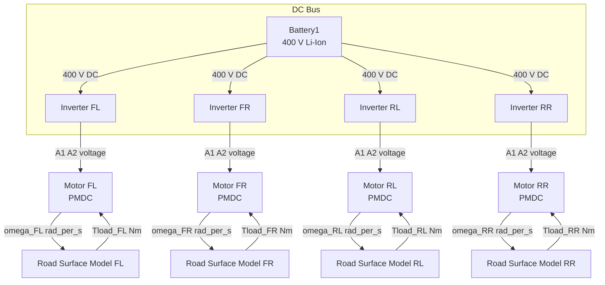
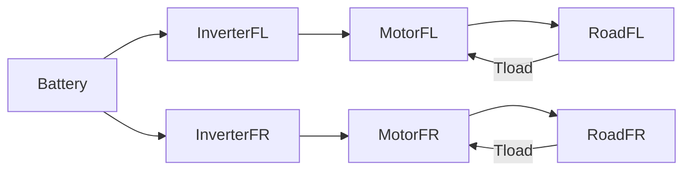
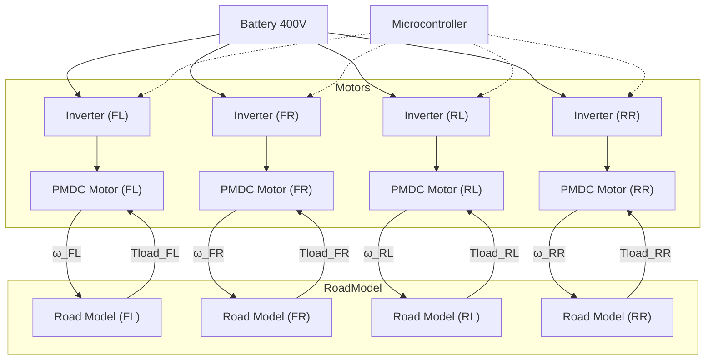

# System Overview

The **“4-drive” Typhoon HIL model** simulates a 4-wheel drive system with four independent single-phase inverters (one at each wheel: Front-Left _FL_, Front-Right _FR_, Rear-Left _RL_, Rear-Right _RR_), each driving a permanent-magnet DC (PMDC) motor. A 400 V Li-Ion battery feeds all inverters. The mechanical load on each wheel comes from a road-surface friction model that computes slip and tire forces. The key subsystems are:  

- **Battery/DC Bus (Root):** A 400 V Lithium-Ion battery (`Battery1`) and DC bus that powers all four inverters.  
- **FL, FR, RL, RR Subsystems:** Each contains a *Single-Phase Inverter* and a *PMDC Motor*. The inverter takes the DC bus voltage and two digital control signals (one per leg) from the HIL’s digital inputs to generate a bipolar output. The PMDC motor receives the inverter output and produces mechanical torque and speed. Each PMDC block has a built-in current sensor (`Iarm`) and outputs like speed (ω, rad/s) and electrical torque (Te, N·m).  
- **Road Surface Model (road_surface_model_fl):** Computes tire slip, friction coefficient, traction force, and load torque for the FL wheel (similar models exist internally or by symmetry for other wheels). Inputs are wheel linear speed (v_wheel), vehicle speed (v_vehicle), and a friction scale. Outputs include slip ratio, `µ` (road friction coefficient), friction force (Fx, N), and load torque (Tload, N·m).  

The subsystems interconnect as follows (illustrated in Mermaid below): each inverter is fed from the common DC bus; its outputs drive the motor. Each wheel’s motor speed feeds into the road model, which returns a torque load on the motor shaft.  TLM (transmission-line model) *Core Coupling* elements (not shown in detail) are used internally to connect front and rear axles for stability but can be considered internal to each wheel subsystem.



The digital control chain is: the **microcontroller** generates two PWM/digital signals per inverter (one per switch leg). These are wired into the Typhoon HIL 404’s *Digital Inputs* (configured as “Digital Input Per Leg” for single-phase inverters). In simulation, these digital inputs drive the inverter model. On the HIL, digital outputs from the model can loop back to digital inputs if needed (TyphoonSim does internal DI/DO loopback).

## Front-Left (FL) Subsystem 

- **Single-Phase Inverter (FL):**  A two-leg inverter block. Its inputs are: 
  - **InA**: DC bus voltage (400 V from battery).  
  - **A_in, B_in**: Gate signals (logic inputs, 0/1) controlling the lower/upper switches of the H-bridge. In practice these come from the MCU through HIL DI pins (e.g. DI1 = leg A, DI2 = leg B for FL).  
  - **En**: Enable input (derived from control, usually high).  
  - Its outputs are the H-bridge terminals: **pos_out**, **neg_out**. These connect to the PMDC motor terminals.

- **PMDC Motor (FL):** A permanent-magnet DC motor block. Key signals (with units) are:
  - **Iarm (A):** Armature current (sensor output). 
  - **omega_FL (rad/s):** Rotor angular speed (mechanical output).  
  - **theta_FL (rad):** Rotor electrical angle (internal state).  
  - **Te_FL (N·m):** Electromagnetic torque (output).  
  - **TL_FL (N·m):** Load torque on the motor shaft (fed from Road model).  
  - **Vbatt (V):** Battery voltage input (400 V). 

The FL inverter/motor sees the wheel radius (R = 0.3 m) and wheel normal force (Fz = 2943 N) in the road model. 

**Signals:**  
- _v_wheel_FL_ (m/s): Wheel linear speed, calculated as ω_FL·R.  
- _slip_FL_ (unitless): Slip ratio = (v_wheel_FL – v_vehicle)/max(|v_vehicle|, v_min). Signed, in range [–1,1].  
- _|slip_FL|_ (unitless): Absolute slip.  
- _sign(slip_FL)_ (±1): Slip direction.  
- _µ_FL_ (unitless): Friction coefficient from the tire model.  
- _Fx_FL_ (N): Longitudinal friction force = µ_FL·Fz.  
- _Tload_FL_ (N·m): Load torque on FL wheel = Fx_FL·R.  

These outputs of the road model are fed back into the PMDC block as mechanical load torque. (The load torque opposes the motor’s torque when slip>0.) 

Units summary (FL): 
| Signal          | Units     |
|-----------------|-----------|
| v_wheel_FL      | m/s       |
| v_vehicle (input) | m/s     |
| slip_FL         | – (ratio) |
| µ_FL            | – (coeff) |
| Fx_FL           | N         |
| Tload_FL        | N·m       |
| ω_FL            | rad/s     |
| Iarm (FL)       | A         |
| Te_FL           | N·m       |
| Vbattery        | V         |

**Pins/Outputs:** In the HIL model, key signals from FL can be routed to HIL I/O: for example, the **FL.load** (shaft torque) is connected via a “From” block to an Analog Output (e.g. AO1). The road-model outputs (slip, µ, Fx, Tload) are visible in the SCADA panel.  (The exact AO channel numbers depend on the Typhoon output configuration.) 

## Front-Right (FR) Subsystem 

Structurally identical to FL but for the right side. Signals and units are the same form (labelled with FR). For example:
- _ω_FR (rad/s)_, _Te_FR (N·m)_, _Iarm_FR (A)_, _v_wheel_FR (m/s)_, _slip_FR_, _µ_FR_, _Fx_FR (N)_, _Tload_FR (N·m)_.
The HIL digital inputs for FR control might be DI3 and DI4 (assign one per leg of the FR inverter). The road-model for FR uses the same formulas (wheel R, Fz). 

**Mermaid snippet for FL/FR:** 


## Rear-Left (RL) and Rear-Right (RR) Subsystems 

Similarly, the RL and RR subsystems each have a single-phase inverter and PMDC motor with identical structure. Signals (ω_RL, Iarm_RL, slip_RL, µ_RL, etc.) use the same units and interpretation as above. Example:
- _ω_RL (rad/s)_, _Tload_RL (N·m)_, etc.
Digital control for RL might use HIL DI5/DI6 and for RR DI7/DI8 (one pin per leg). The road model for RL/RR is conceptually the same (wheel radius and normal force assumed equal). 
Mermaid:


## Road Surface Model

The `road_surface_model_fl` subsystem (and similarly for other wheels) computes tire slip and forces. Its inputs are:
- **v_wheel (m/s):** Wheel linear velocity (ω·R).  
- **v_vehicle (m/s):** Vehicle forward speed (model input).  
- **µ_scale (–):** A scaling factor (0 to 1) for friction (to simulate different road grip).

Internal parameters: wheel radius _R = 0.3 m_, normal load _Fz = 2943 N_, minimum vehicle speed _v_min = 0.5 m/s_ (to avoid division by zero). 

Key computations (see formulas below) produce outputs:
- **slip (–):** `(v_wheel – v_vehicle)/max(|v_vehicle|, v_min)`, clamped to [–1,1].  
- **abs_slip (–):** absolute value of slip.  
- **sign (±1):** +1 if slip>0, –1 if slip<0, 0 if slip≈0.  
- **µ_base (–):** Base tire friction curve from a lookup table (for slip vs. µ).  
- **µ (–):** Scaled friction coefficient = µ_scale * µ_base(abs_slip).  
- **Fx (N):** Longitudinal force = µ * Fz.  
- **Tload (N·m):** Torque on wheel = Fx * R.  

(These equations follow a standard tire slip model.) The load torque `Tload` is fed back to the PMDC motor as an opposing torque, and influences the motor’s speed in the next instant.

## Signal Units and Pin Assignments

Below is a summary of major signals from each subsystem, their meaning, units, and how they interface with the hardware:

| Signal                      | Unit        | Source/Subsystem        | To Hardware                             |
|-----------------------------|-------------|-------------------------|-----------------------------------------|
| **Battery1 voltage (V)**    | V           | Root (Battery1)         | Internal (not directly I/O)             |
| **Motor current (Iarm\_*)** | A           | Each PMDC block         | (Can be probed via ADC on MCU if needed)|
| **Angular speed (ω\_*)**    | rad/s       | Each PMDC block         | (Not directly I/O in this model)        |
| **Wheel speed (v\_wheel\_*)**| m/s        | Computed (ω·R)          | (SCADA shows v_wheel signals)           |
| **Vehicle speed (v_vehicle)**| m/s        | SCADA input             | (From SCADA/UI into model)              |
| **Slip (slip\_*)**          | – (ratio)   | Road model output       | (Shown in SCADA panel)                  |
| **Slip sign (sign\_*)**     | ±1          | Road model output       | (Shown in SCADA panel)                  |
| **Friction coeff. (µ\_*)**  | – (coeff)   | Road model output       | (Shown in SCADA panel)                  |
| **Friction force (Fx\_*)**  | N           | Road model output       | (Shown in SCADA panel)                  |
| **Load torque (Tload\_*)**  | N·m         | Road model output       | Often sent to AO (e.g. AO1 = FL load)   |

(“\*” = replace with FL, FR, RL, RR accordingly.) In practice, each `Tload` (motor load torque) is connected to an analog output channel on the HIL (e.g. AO1=FL.Tload, AO2=FR.Tload, etc.) so the microcontroller can measure it via its ADC inputs if desired. The exact AO pin numbers depend on the Typhoon I/O configuration. 

The **digital control pins** from the microcontroller connect to the HIL’s digital inputs.  For “Digital Input Per Leg” mode on a single-phase inverter, *two* DI pins are assigned (one for each leg). A typical mapping could be:  
- DI1 = FL leg A, DI2 = FL leg B,  
- DI3 = RL leg A, DI4 = RL leg B,  
- DI5 = FR leg A, DI6 = FR leg B,  
- DI7 = RR leg A, DI8 = RR leg B.  

The microcontroller drives its GPIO outputs (set HIGH/LOW) according to the desired PWM gating. Those pins are wired to the HIL404 so that each high/low on DIx toggles the corresponding switch in the inverter model. (On the HIL404 hardware, these DI pins expect 0–5 V TTL signals. In TyphoonSim they loop back internally, but on hardware you connect them to the DUT.) 

## Connection Diagram

Below is a conceptual diagram of the signal flow between components. Rectangles are subsystems/blocks, arrows show signal/data flow. *(This is a schematic view, not a literal wiring diagram.)*



**Figure:** Block-flow of the 4WD model. (Dotted arrows: digital gate signals from MCU to each inverter.)

## Code Composer Project Structure

The microcontroller firmware (in the Code Composer project) is organized as follows:

- **`main.c` (or equivalent):** The entry point. It calls system initialization routines and then enters the infinite `while(1)` loop. Typically, initialization includes:  
  - `InitSysCtrl()`, `InitGpio()`, `InitAdc()`, `InitPwm()` (or HAL equivalents) to configure clocks, pins, ADC channels, PWM modules, etc.  
  - Timer interrupt setup for a fixed control rate (e.g. a periodic CPU timer or PWM interrupt).  
  - Enable interrupts globally.

- **Interrupt Service Routines (ISRs):** The main control algorithms run in an ISR triggered by a timer or PWM event. For example:  
  ```c
  __interrupt void controlISR(void)
  {
      // (1) Read ADC measurements (e.g. armature currents via ADC, if any).
      // (2) Compute control law (e.g. PI controller, estimation algorithm, etc.).
      // (3) Update PWM duty registers to adjust switch pulses.
      // (4) Acknowledge/clear interrupt flag.
  }
  ```
  This ISR runs at a fixed rate (e.g. 10 kHz) to update the switching signals. 

- **Main Loop (`while(1)`):** In a typical fast motor control setup, the main loop does minimal work (e.g. background housekeeping, toggling LEDs, or updating CAN/UART). Most of the action is in ISRs. If sensor readings or user commands must be processed, this can occur in main or via other interrupts. 

- **Pin Initialization:** In startup code, GPIO pins are configured. For example (pseudocode for a TI device):  
  ```c
  // Configure PWM pins for inverter (if PWM used) or general outputs for digital gating:
  GPIO_setPinConfig(GPIO_0_GPIO0); // e.g. set P0 as digital output
  GpioDataRegs.GPACLEAR.bit.GPIO0 = 1; // initialize to 0
  // Repeat for each control pin: FL_legA, FL_legB, ..., RR_legB.

  // Configure ADC pins if reading any analog signals
  GPIO_setPinConfig(ADCINA0); // e.g. A0 for Iarm sensing
  ```

- **Sending Control to HIL (Digital Output):** To drive the inverter, the firmware writes to its digital output pins. On a TI C2000, for example:
  ```c
  // Example: set FL leg A ON, FL leg B OFF:
  GpioDataRegs.GPASET.bit.GPIO0 = 1;  // drive corresponding DI pin high
  GpioDataRegs.GPACLEAR.bit.GPIO1 = 1; // drive other leg low
  ```
  These GPIO pins must be physically wired (on the HIL or connector) to the HIL404 digital input pins (e.g. HIL DI1 and DI2 for FL). In Typhoon HIL mode, setting a digital output line high simulates a gate ON.

- **Interrupts and ADC:** Set up the ADC to sample armature currents or other sensors, triggered by the PWM timer. In the ISR, read ADC values and compute motor control (or estimation).

- **HIL404 Digital Input Mapping:** On the HIL404 hardware, the digital input pins (DI1–DI32) are labeled. For example, to use “Digital Input per leg” mode for single-phase, assign DI1 and DI2 to the legs of one inverter. The firmware’s digital outputs must drive the pins wired to those DI. The Typhoon model then reads DI1–DI8 as the inverter gate inputs. 

For **switching a leg via HIL**: Typhoon documentation notes that for internal simulation, DI pins loop back to DO (any digital output appears on the same-numbered digital input). But on real HIL hardware, the MCU must drive the DI pins explicitly.

## SCADA and Code Connection

- The Typhoon SCADA panel is used to set input parameters: e.g. **vehicle speed** (`v_vehicle`) and friction scale (`µ_scale`) via sliders. These write into the model before/during simulation.  
- SCADA plots key signals (slip, µ, Tload, etc.) for debugging. 

- In code, you do *not* program SCADA – you program the microcontroller firmware. SCADA is only for simulation interface. 

- The Typhoon `hil.model_read()` and `hil.model_write()` calls in the SCADA C-scripts link UI widgets to model variables (e.g. `hil.model_write("road_surface_model_fl.v_vehicle", value)`). This is separate from the MCU code.

## Summary

This README has outlined the structure of the Typhoon **4-drive** model and the accompanying MCU project. Each wheel’s inverter–motor subsystem produces and measures quantities (speed, torque, current) in specific units (rad/s, N·m, A, etc.). The road model produces tire slip and forces (unitless slip, N·m torque). 

On the hardware side, the microcontroller code must initialize the CPU peripherals (timers, ADCs, PWM or GPIO) and implement a control ISR for the PWM signals. Two GPIO outputs per inverter (one per leg) should be wired to the HIL404’s digital input pins (configured as “per-leg” control). The firmware’s main loop runs the rest of the application (status, communication), while the real-time control happens in interrupts. 

This document should provide sufficient context for a developer (or an AI agent) to understand how the Typhoon model is structured and how the firmware should interface with it. The inverter control loop is centered around setting digital outputs (HIL DIs) to drive the simulated switches, and (optionally) reading analog feedback via ADCs mapped to the HIL AOs. From here, the firmware can be developed or extended to complete the motor control and parameter estimation tasks.  

