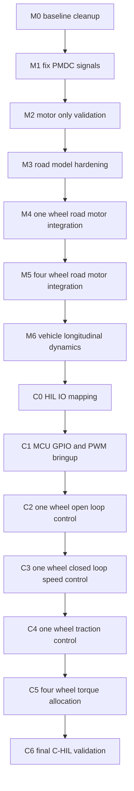
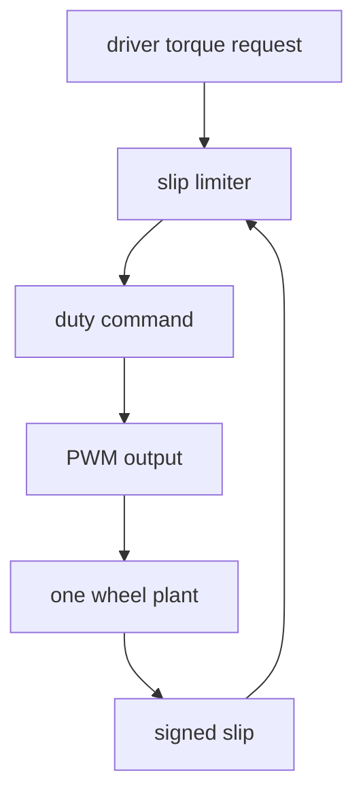
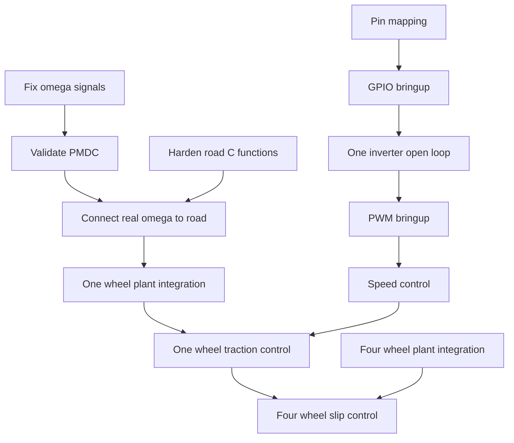

# 4-drive HIL Project - Detailed Task List

**Project:** 4-wheel EV traction-control C-HIL model using Typhoon HIL404 and TI LAUNCHXL-F28379D  
**Model files:** `4-drive.tse`, `4-drive SCADA.cus`  
**Purpose of this document:** This file is a detailed task backlog and implementation roadmap. It is meant to be used together with the detailed model README. It is written as a context source for a human firmware engineer and for an AI coding agent that will continue work on the Typhoon HIL model, the SCADA panel, the HIL404 I/O interface, and the embedded traction-control firmware.

---

## 0. Current Project State Summary

The current system models a 4-wheel electric vehicle plant with four independent wheel drives:

- `FL` - front-left drive subsystem
- `FR` - front-right drive subsystem
- `RL` - rear-left drive subsystem
- `RR` - rear-right drive subsystem

Each wheel subsystem contains:

- one `Single Phase Inverter`
- one manually implemented PMDC motor model
- electrical and mechanical measurements
- a load torque input intended to be driven by the road/tire model

The root model contains:

- `Battery1`, nominal 400 V lithium-ion source
- `C1` DC-link capacitor
- `VCbat` voltage measurement
- TLM core couplings for partitioning the electrical network across HIL404 processing cores
- `road_surface_model_fl`, currently implemented as a road/tire slip model block that has been mostly tested in isolation
- SCADA widgets and capture traces for debugging slip, friction, force, load torque, wheel speed, and vehicle speed

The model has already passed several important early validation steps:

- four-inverter electrical partitioning compiles on HIL404
- the manual PMDC approach avoids machine-solver overload
- four-wheel open-loop symmetry was achieved before adding the road model
- constant `Tload` tests confirmed that load can affect the motor when correctly connected
- isolated road/tire phase B tests confirmed:
  - `v_wheel = Rw * omega`
  - signed slip calculation
  - absolute slip calculation
  - slip sign calculation
  - friction lookup scaling
  - longitudinal force calculation
  - tire load torque calculation

Known important issues from the current `4-drive.tse` inspection:

1. The `mech_speed_fr` probe/signal in PMDC subsystems was connected to the `E_bemf` branch instead of the real `omega` signal. This makes speed appear as zero when `Ke = 0` even though the internal speed may be nonzero.
2. The `Tload` branch inside the PMDC subsystem contains a gain set to `0`, so the external load may currently be disabled in the uploaded model.
3. The road surface model currently uses `omega_test` for isolated tests instead of the true `omega_FL`, `omega_FR`, `omega_RL`, and `omega_RR` tags from the motors.
4. Road model output tags such as `Tload_FL`, `Tload_FR`, `Tload_RL`, and `Tload_RR` are already routed toward wheel subsystems, so enabling the PMDC `Tload` gain will immediately couple the road model into the motor dynamics.
5. HIL404 DI mapping for external MCU control is not yet finalized and should be explicitly documented and tested pin-by-pin.

---

## 1. How To Read This Task List

Tasks are split into two major groups:

1. **Model and dynamics tasks** - Typhoon model, PMDC dynamics, tire/road model, SCADA, HIL resources, validation traces.
2. **Control and firmware tasks** - microcontroller control, GPIO/PWM, HIL DI driving, one-wheel prototype control, then 4-wheel traction control.

Each task has:

- **Goal** - what must be achieved
- **Why it matters** - why this task exists
- **Steps** - implementation work
- **Expected result** - what should be true afterwards
- **Acceptance criteria** - how to decide that the task is done
- **Dependencies** - tasks that should be completed first
- **Artifacts** - files, traces, commits, or plots that should be produced

Priority labels:

- `P0` - blocking task; do before continuing integration
- `P1` - important; do in next integration cycle
- `P2` - useful but not blocking
- `P3` - optional refinement

Status labels:

- `[ ]` - not started
- `[~]` - in progress or partially implemented
- `[x]` - done and validated
- `[!]` - known issue / requires correction

---

## 2. High-Level Roadmap



---

# PART A - MODEL AND DYNAMICS TASKS

---

## M0 - Baseline File Hygiene And Reproducibility

**Priority:** P0  
**Status:** [ ]  
**Owner:** model/dynamics  

### Goal

Create a clean, reproducible baseline of the current model and make sure all future changes can be traced.

### Why it matters

The model has gone through many rapid edits: motor parameters, PMDC wiring, road model testing, TLM partitioning, and SCADA changes. Before deeper control integration, the team needs a stable baseline that can be reverted to.

### Steps

- [ ] Create a repository folder layout for HIL model files:
  - `hil/4-drive.tse`
  - `hil/4-drive SCADA.cus`
  - `hil/captures/`
  - `hil/docs/`
  - `hil/exports/`
- [ ] Commit current `4-drive.tse` and `4-drive SCADA.cus` as a named baseline.
- [ ] Add a short `CHANGELOG.md` with one entry per model edit.
- [ ] Add a `captures/README.md` explaining how CSV files should be named.
- [ ] Define a naming convention:
  - `YYYYMMDD_HHMM_description.csv`
  - example: `20260609_204610_phaseB_mu_step.csv`
- [ ] Save compiler logs for each successful HIL compile.
- [ ] Save model parameter snapshots after every major change.

### Expected Result

The team can answer:

- Which model version produced which CSV?
- Which motor parameters were active?
- Was road model connected or isolated?
- What was the HIL compile configuration?

### Acceptance Criteria

- [ ] Current model files are versioned.
- [ ] There is a folder for validated CSV captures.
- [ ] Every future task can reference a model commit and capture file.

### Dependencies

None.

### Artifacts

- Git commit: `baseline-hil-4-drive-before-road-integration`
- `hil/captures/README.md`
- `hil/CHANGELOG.md`

---

## M1 - Fix PMDC Mechanical Speed Signal Routing

**Priority:** P0  
**Status:** [!]  
**Owner:** model/dynamics  

### Goal

Correct the PMDC speed measurement/probe so that `mech_speed_*` is connected to the actual internal angular speed `omega`, not to the `E_bemf` branch.

### Why it matters

The current model inspection showed that a speed signal such as `mech_speed_fr` was routed from the `Ke` / `E_bemf` path. When `Ke = 0`, the speed probe becomes zero even if the internal rotor speed is nonzero. This invalidates speed plots, slip computation, and any future controller feedback.

### Steps

For each PMDC subsystem: `FL.PMDC`, `FR.PMDC`, `RL.PMDC`, `RR.PMDC`:

- [ ] Locate the internal `omega` signal.
- [ ] Confirm it is the output of the mechanical speed integrator:
  - torque sum -> `1/J` gain -> speed integrator -> `omega`
- [ ] Disconnect `mech_speed_*` probe/output from `Ke.out` or `E_bemf.in`.
- [ ] Connect `mech_speed_*` to the actual `omega` node.
- [ ] Confirm the same `omega` node feeds:
  - `Gain_Ke`
  - viscous friction gain `b`
  - theta rollover integrator input
  - global omega tag for road model integration
- [ ] Rename ambiguous probes:
  - `mech_speed_fr` -> `omega_internal_FR`
  - `mech_angle_fr` -> `theta_FR`
  - repeat for all wheels

### Expected Result

When `Ke = 0`:

- `E_bemf = 0`
- `omega_internal` can be nonzero
- `theta` changes only if `omega_internal` is nonzero
- speed and angle are physically consistent

### Acceptance Criteria

Run motor-only test with:

```text
Ke = 0
Tload = 0
duty = 0.05
```

Capture:

- `Iarm_*`
- `Te_*`
- `omega_internal_*`
- `theta_*`
- `E_bemf_*`

Done when:

- [ ] `E_bemf_* = 0`
- [ ] `omega_internal_*` is not falsely zero
- [ ] `theta_*` derivative matches `omega_internal_*`
- [ ] all four wheels are symmetric under identical commands

### Dependencies

- M0 baseline

### Artifacts

- CSV: `motor_only_ke0_speed_probe_fixed.csv`
- Screenshot of corrected PMDC internal wiring
- Commit: `fix-pmdc-omega-probe-routing`

---

## M2 - Verify PMDC Electrical And Mechanical Equations

**Priority:** P0  
**Status:** [~]  
**Owner:** model/dynamics  

### Goal

Validate that the manually implemented PMDC model obeys the intended equations:

```text
V_a1a2 = Ra * Iarm + La * dIarm/dt + E_bemf
E_bemf = Ke * omega
Te = Kt * Iarm
domega/dt = (Te - Tload - b * omega) / J
theta = integral(omega) with rollover at 2*pi
```

### Why it matters

The whole traction-control plant depends on reliable motor speed and torque response. Any sign error in `Ke`, `Kt`, `Tload`, or viscous friction can create unstable dynamics or misleading slip behavior.

### Steps

- [ ] Add direct internal probes inside one PMDC subsystem first, preferably `FL.PMDC`:
  - `V_a1a2`
  - `Iarm`
  - `E_bemf`
  - `Te`
  - `Tload_after_gain`
  - `friction_torque`
  - `torque_sum`
  - `alpha`
  - `omega`
  - `theta`
- [ ] Copy the same probe structure to the other three PMDC subsystems after FL is validated.
- [ ] Run with `Ke = 0` and `Tload = 0`.
- [ ] Run with `Ke = 0.3`, `Tload = 0`.
- [ ] Run with `Ke = 0.3`, `Tload = 3 Nm`.
- [ ] Run with `Ke = 0.3`, `Tload = 10 Nm`.
- [ ] Compare expected signs:
  - positive current -> positive torque
  - positive omega -> positive back-EMF
  - positive load torque -> opposes motor torque
  - positive omega -> positive viscous loss term that opposes rotation

### Expected Result

The motor should accelerate to a finite speed and not diverge to `Inf` or `NaN`. The final speed should decrease when positive load torque increases.

### Acceptance Criteria

- [ ] No `NaN` or `Inf` values for at least 1 second simulation.
- [ ] `Te = Kt * Iarm` matches within numerical tolerance.
- [ ] `E_bemf = Ke * omega` matches within numerical tolerance.
- [ ] `theta` is consistent with the integral of `omega`.
- [ ] four-wheel symmetry error is below a defined threshold under identical commands.

Suggested symmetry thresholds:

```text
max_abs_delta_omega < 1 rad/s
max_abs_delta_Iarm < 0.5 A
max_abs_delta_theta < 0.05 rad
```

### Dependencies

- M1 PMDC speed signal fixed

### Artifacts

- CSV: `pmdc_equation_validation_ke0.csv`
- CSV: `pmdc_equation_validation_ke03_tload0.csv`
- CSV: `pmdc_equation_validation_ke03_tload3.csv`
- CSV: `pmdc_equation_validation_ke03_tload10.csv`
- Python notebook or script for equation residual checks

---

## M3 - Fix And Decide Load Torque Scaling In PMDC

**Priority:** P0  
**Status:** [!]  
**Owner:** model/dynamics  

### Goal

Make an explicit design decision about how `Tload` enters the PMDC equation and remove accidental zeroing of load torque.

### Current Finding

The uploaded model has a gain in the PMDC `Tload` path set to `0`. This means external load may currently be disabled.

### Why it matters

If the gain remains `0`, the road/tire model cannot affect motor speed. If it is changed directly to `1`, the full tire load can be very large, possibly hundreds of N*m, which may overwhelm the current test motor parameters.

### Required Design Decision

Choose one of these two conventions for initial integration:

#### Option A - Debug-scale load torque

```text
Tload_to_PMDC = K_load_scale * abs(Tload_tire)
```

Recommended initial value:

```text
K_load_scale = 0.01
```

Use this for first integration because it avoids sign feedback problems and keeps torque in the range already tested.

#### Option B - Signed physical tire torque

```text
Tload_to_PMDC = Tload_tire_signed
```

Use only after the vehicle longitudinal dynamics and force sign convention are fully validated.

### Steps

- [ ] Rename the PMDC internal load gain to `Gain_Tload_to_PMDC`.
- [ ] Replace hard-coded gain `0` with a model parameter:

```python
K_load_scale = 0.01
```

- [ ] For early testing, route:

```text
Tload_tire_abs -> Gain_K_load_scale -> PMDC.Tload
```

- [ ] Keep signed tire force available as a separate monitored signal:

```text
Fx_signed
Tload_signed
```

- [ ] Do not feed signed tire load directly into PMDC until M9 is complete.

### Expected Result

Road/tire load affects wheel speed but does not immediately destabilize the model.

### Acceptance Criteria

- [ ] `Tload_to_PMDC` is visible as a probe.
- [ ] `Tload_to_PMDC = 0.01 * abs(Tload_tire)` during first integration.
- [ ] motor speed decreases when `Tload_to_PMDC` increases.
- [ ] lower `mu_scale` produces lower `Tload_to_PMDC` and easier wheel spin.

### Dependencies

- M2 PMDC equations validated

### Artifacts

- Model screenshot of PMDC load path
- CSV: `single_wheel_scaled_tload_test.csv`
- Commit: `parameterize-pmdc-load-scale`

---

## M4 - Revalidate Four-Wheel Electrical Symmetry After PMDC Fixes

**Priority:** P0  
**Status:** [~]  
**Owner:** model/dynamics  

### Goal

Ensure that fixes to PMDC signals and load path did not break the previously achieved four-wheel symmetry.

### Steps

- [ ] Set all four wheels to identical motor parameters.
- [ ] Use global model parameters:

```python
Kt = 0.5
Ke = 0.3
Ra = 0.5
La = 1e-3
J = 0.02
b = 0.002
```

- [ ] Set all loads to zero.
- [ ] Apply identical inverter command to all wheels.
- [ ] Capture:
  - `Vab_FL`, `Vab_FR`, `Vab_RL`, `Vab_RR`
  - `Iarm_FL`, `Iarm_FR`, `Iarm_RL`, `Iarm_RR`
  - `omega_FL`, `omega_FR`, `omega_RL`, `omega_RR`
  - `theta_FL`, `theta_FR`, `theta_RL`, `theta_RR`
  - `E_bemf_FL`, `E_bemf_FR`, `E_bemf_RL`, `E_bemf_RR`

### Expected Result

All four wheels should overlap under identical input and load conditions.

### Acceptance Criteria

- [ ] `FL approx FR approx RL approx RR` for voltage, current, speed, back-EMF, and angle.
- [ ] No pair splitting such as `FL/RL` versus `FR/RR` unless intentionally introduced.
- [ ] No `NaN` or `Inf`.

### Dependencies

- M1
- M2
- M3

### Artifacts

- CSV: `four_wheel_symmetry_after_pmdc_fix.csv`
- Plot: `four_wheel_symmetry_after_pmdc_fix.png`

---

## M5 - Back-EMF Polarity Validation

**Priority:** P0  
**Status:** [ ]  
**Owner:** model/dynamics  

### Goal

Confirm that back-EMF is physically opposing the applied armature voltage rather than reinforcing it.

### Why it matters

A wrong sign in the `E_bemf` controlled voltage source can produce positive feedback:

```text
omega increases -> E_bemf increases in wrong direction -> current increases -> torque increases -> omega increases further
```

This can cause runaway values, `Inf`, and `NaN`.

### Steps

- [ ] Run motor-only test with `Ke = 0`.
- [ ] Run motor-only test with `Ke = +0.3`.
- [ ] If `Ke = +0.3` diverges, try exactly one of:
  - invert sign of `Gain_Ke`
  - reverse polarity of the controlled voltage source
- [ ] Do not change both at the same time.
- [ ] Check the no-load speed estimate:

```text
omega_no_load approx V_effective / Ke
```

### Expected Result

With correct polarity, increasing speed reduces current at a fixed applied voltage.

### Acceptance Criteria

- [ ] motor speed approaches a finite value
- [ ] current falls as back-EMF rises under no-load conditions
- [ ] no runaway when `Ke` is nonzero

### Dependencies

- M2 PMDC equation probes

### Artifacts

- CSV: `ke_polarity_validation_positive.csv`
- CSV: `ke_polarity_validation_negative_if_needed.csv`
- Decision note: `back_emf_polarity_decision.md`

---

## M6 - Harden Road Surface Model C Functions

**Priority:** P0  
**Status:** [~]  
**Owner:** model/dynamics  

### Goal

Make the road/tire slip C functions robust against division by zero, unconnected inputs, `NaN`, and `Inf`.

### Current State

The isolated road/tire tests passed after correcting `signed_slip` versus `abs_slip`. However, the C functions should be hardened before being coupled into motor dynamics.

### Required C Function Behavior

Inputs:

```text
v_wheel    [m/s]
v_vehicle  [m/s]
```

Outputs:

```text
signed_slip  [-]
abs_slip     [-]
slip_sign    [-1, 0, +1]
```

Required formula:

```text
signed_slip = (v_wheel - v_vehicle) / max(abs(v_vehicle), v_min)
abs_slip = abs(signed_slip)
slip_sign = sign(signed_slip) with deadband
```

Recommended safe C-code pattern:

```c
double v_min_local = 0.5;
double denom = fabs(v_vehicle);
double s;

if (denom < v_min_local) {
    denom = v_min_local;
}

s = (v_wheel - v_vehicle) / denom;

if (s > 1.0) {
    s = 1.0;
}
if (s < -1.0) {
    s = -1.0;
}

/* NaN protection: comparisons with NaN return false */
if (!(s <= 1.0 && s >= -1.0)) {
    s = 0.0;
}

signed_slip = s;
abs_slip = fabs(s);

if (s > 0.001) {
    slip_sign = 1.0;
} else if (s < -0.001) {
    slip_sign = -1.0;
} else {
    slip_sign = 0.0;
}
```

### Steps

- [ ] Apply robust C function logic to FL, FR, RL, RR road models.
- [ ] Ensure every C function input is connected.
- [ ] Ensure no input depends on an uninitialized SCADA variable.
- [ ] Add probes for:
  - `signed_slip_*`
  - `abs_slip_*`
  - `slip_sign_*`
  - `mu_*`
  - `Fx_*`
  - `Tload_*`
- [ ] Verify that the signal names clearly distinguish signed and absolute slip.

### Expected Result

The road model remains finite for:

```text
v_vehicle = 0
omega = 0
omega positive
omega negative
mu_scale = 0
mu_scale = 1
```

### Acceptance Criteria

- [ ] no `NaN` or `Inf` in any road model output
- [ ] `signed_slip = 0` at zero vehicle speed and zero wheel speed
- [ ] `signed_slip = +0.1` for `v_vehicle = 5`, `omega = 18.333`, `Rw = 0.3`
- [ ] `signed_slip = -0.1` for `v_vehicle = 5`, `omega = 15`, `Rw = 0.3`
- [ ] `abs_slip = 0.1` for both positive and negative slip cases

### Dependencies

- M0

### Artifacts

- CSV: `road_model_zero_speed_safety.csv`
- CSV: `road_model_signed_slip_validation.csv`
- Commit: `harden-road-slip-c-functions`

---

## M7 - Road Model Signal Naming Cleanup

**Priority:** P1  
**Status:** [ ]  
**Owner:** model/dynamics  

### Goal

Make signal names unambiguous for future controller implementation.

### Why it matters

The current bug where `abs_slip` was connected under the name `slip_fl` shows that naming ambiguity can easily mislead both a human and an AI coding agent.

### Required Naming Convention

Use the following names for each wheel:

```text
omega_FL_rad_s
v_wheel_FL_m_s
signed_slip_FL
abs_slip_FL
slip_sign_FL
mu_base_FL
mu_scale_FL
mu_FL
Fx_FL_N
Tload_tire_FL_Nm
Tload_to_PMDC_FL_Nm
```

Repeat for `FR`, `RL`, `RR`.

### Steps

- [ ] Rename probes in Schematic Editor.
- [ ] Rename SCADA signals.
- [ ] Rename capture labels if possible.
- [ ] Add a signal table to the README.
- [ ] Verify that a CSV export contains self-explanatory column names.

### Expected Result

CSV columns and SCADA widgets make it obvious whether a signal is signed, absolute, physical, scaled, or a test input.

### Acceptance Criteria

- [ ] no generic `slip_fl` label without qualifier
- [ ] all road/tire torque signals include either `tire` or `to_PMDC`
- [ ] all units are documented

### Dependencies

- M6

### Artifacts

- Updated `.tse`
- Updated `.cus`
- README signal table update

---

## M8 - Replace `omega_test` With Real Wheel Speeds For Integration

**Priority:** P0  
**Status:** [!]  
**Owner:** model/dynamics  

### Goal

Connect the road model to true PMDC wheel speeds instead of the test signal `omega_test`.

### Current State

The road model currently receives `omega_test` for all four wheel inputs. This is useful for isolated validation, but it is not a real plant integration.

### Steps

- [ ] Keep an isolated test mode switch if desired:

```text
mode = TEST_OMEGA or REAL_OMEGA
```

- [ ] Connect:

```text
omega_FL -> road_surface_model.omega_FL
omega_FR -> road_surface_model.omega_FR
omega_RL -> road_surface_model.omega_RL
omega_RR -> road_surface_model.omega_RR
```

- [ ] Ensure the omega signals come from corrected PMDC internal speed nodes.
- [ ] Remove or disable `omega_test` fanout for integration tests.
- [ ] Keep `omega_test` only for isolated road-model validation.

### Expected Result

Each wheel road model receives its own measured wheel speed.

### Acceptance Criteria

- [ ] if only FL motor is driven, only `omega_FL` changes significantly
- [ ] `signed_slip_FL` responds to `omega_FL`
- [ ] `signed_slip_FR`, `signed_slip_RL`, and `signed_slip_RR` remain consistent with their own wheel states

### Dependencies

- M1
- M6
- M7

### Artifacts

- CSV: `real_omega_to_road_model_one_wheel.csv`
- Commit: `connect-real-wheel-speeds-to-road-model`

---

## M9 - Define Tire Force And Load Torque Sign Convention

**Priority:** P0  
**Status:** [ ]  
**Owner:** model/dynamics + control  

### Goal

Define one consistent sign convention for tire force, wheel torque, and motor load torque.

### Why it matters

A signed tire load can either oppose or assist motor rotation depending on how it is inserted into the PMDC equation:

```text
domega/dt = (Te - Tload - b * omega) / J
```

If `Tload` is negative, then `Te - Tload` becomes `Te + abs(Tload)`. That can create unintended acceleration.

### Recommended Initial Convention

For initial traction-control development:

```text
signed_slip is used for control logic
abs_slip is used for friction lookup
Tload_to_PMDC is non-negative opposing torque
```

That means:

```text
Tload_to_PMDC = K_load_scale * abs(Tload_tire_signed)
```

Later, after vehicle longitudinal dynamics are stable, signed force can be introduced more physically.

### Steps

- [ ] Write a one-page sign convention note.
- [ ] Define positive wheel rotation.
- [ ] Define positive vehicle speed.
- [ ] Define positive motor torque.
- [ ] Define positive tire force.
- [ ] Define positive PMDC load torque.
- [ ] Decide whether braking/regeneration is in scope.
- [ ] Decide how negative slip is handled before braking control exists.

### Expected Result

No one should need to guess whether `Tload` should be positive or negative.

### Acceptance Criteria

- [ ] sign convention documented in README
- [ ] model wiring follows the documented convention
- [ ] controller uses the same convention
- [ ] one positive-slip and one negative-slip test demonstrate expected signs

### Dependencies

- M2
- M3
- M6

### Artifacts

- `docs/sign_convention.md`
- CSV: `positive_slip_sign_convention.csv`
- CSV: `negative_slip_sign_convention.csv`

---

## M10 - Integrate One Wheel Road Model With One PMDC Motor

**Priority:** P0  
**Status:** [ ]  
**Owner:** model/dynamics  

### Goal

Close the loop between one motor and one road model, preferably FL first.

### Steps

Use FL only:

- [ ] Drive only `FL` inverter.
- [ ] Keep `FR`, `RL`, `RR` disabled or with zero command.
- [ ] Connect corrected `omega_FL` to road model.
- [ ] Connect scaled non-negative road load to `FL.PMDC.Tload`:

```text
Tload_to_PMDC_FL = 0.01 * abs(Tload_tire_FL)
```

- [ ] Use constant `v_vehicle = 5 m/s` for the first test.
- [ ] Use `mu_scale_FL = 1.0`.
- [ ] Repeat with `mu_scale_FL = 0.2`.

### Expected Result

At lower friction scale:

```text
mu lower -> tire load lower -> wheel spins more easily -> omega higher -> signed slip higher
```

### Acceptance Criteria

- [ ] FL closed-loop plant remains finite.
- [ ] lower `mu_scale_FL` gives lower `Tload_to_PMDC_FL`.
- [ ] lower `mu_scale_FL` gives larger `signed_slip_FL` under the same inverter command.
- [ ] no `NaN` or `Inf`.

### Dependencies

- M8
- M9

### Artifacts

- CSV: `one_wheel_road_motor_mu1.csv`
- CSV: `one_wheel_road_motor_mu02.csv`
- Plot comparing omega, slip, mu, Tload

---

## M11 - Integrate Four-Wheel Road Model With Four PMDC Motors

**Priority:** P1  
**Status:** [ ]  
**Owner:** model/dynamics  

### Goal

Connect all four road/tire models to all four PMDC motors.

### Steps

- [ ] Connect all four corrected omega signals to road model inputs.
- [ ] Connect all four scaled road loads to PMDC `Tload` inputs.
- [ ] Use same `mu_scale` for all wheels.
- [ ] Validate four-wheel symmetry.
- [ ] Test split-mu scenario:

```text
mu_FL = 1.0
mu_RL = 1.0
mu_FR = 0.2
mu_RR = 0.2
```

- [ ] Test one-wheel ice patch:

```text
mu_FL = 0.1
mu_FR = 1.0
mu_RL = 1.0
mu_RR = 1.0
```

### Expected Result

- same road condition -> all four wheels behave symmetrically
- lower friction wheel -> lower load torque and higher slip under the same motor command

### Acceptance Criteria

- [ ] same-mu symmetry passes
- [ ] split-mu behavior matches physics
- [ ] one-wheel ice behavior matches physics
- [ ] no `NaN` or `Inf`

### Dependencies

- M10

### Artifacts

- CSV: `four_wheel_same_mu.csv`
- CSV: `four_wheel_split_mu_left_right.csv`
- CSV: `four_wheel_single_ice_patch.csv`

---

## M12 - Add Vehicle Longitudinal Dynamics

**Priority:** P1  
**Status:** [ ]  
**Owner:** model/dynamics  

### Goal

Replace constant `v_vehicle` with a dynamic vehicle-speed model.

### Current Simplification

For isolated road model testing, `v_vehicle` is a SCADA input. That is useful for testing slip equations, but a real traction-control plant should update vehicle speed from total longitudinal tire force.

### Proposed Equations

```text
Fx_total = Fx_FL + Fx_FR + Fx_RL + Fx_RR
F_roll = Crr * m * g
F_drag = 0.5 * rho * CdA * v_vehicle^2
F_net = Fx_total - F_roll - F_drag
a_vehicle = F_net / m
v_vehicle = integral(a_vehicle)
```

Start with the simplest version:

```text
v_vehicle = integral(Fx_total / m)
```

Then add rolling resistance and drag later.

### Steps

- [ ] Create subsystem `vehicle_longitudinal_dynamics`.
- [ ] Inputs:
  - `Fx_FL_N`
  - `Fx_FR_N`
  - `Fx_RL_N`
  - `Fx_RR_N`
- [ ] Outputs:
  - `Fx_total_N`
  - `a_vehicle_m_s2`
  - `v_vehicle_m_s`
- [ ] Add initial vehicle speed parameter:

```python
v_vehicle_init = 0.0
```

- [ ] Add saturation so `v_vehicle` does not become negative in early propulsion tests.
- [ ] Keep an override mode where SCADA can force `v_vehicle` for debugging.

### Expected Result

The plant can simulate launch from rest and wheel slip during acceleration.

### Acceptance Criteria

- [ ] `v_vehicle` increases when total traction force is positive
- [ ] `v_vehicle` remains finite
- [ ] no division by zero in slip at low speed
- [ ] controller can use either measured wheel speeds or vehicle speed estimate

### Dependencies

- M11

### Artifacts

- CSV: `vehicle_dynamics_launch_no_control.csv`
- CSV: `vehicle_dynamics_split_mu_no_control.csv`

---

## M13 - Verify And Document TLM Core Coupling Strategy

**Priority:** P1  
**Status:** [~]  
**Owner:** model/dynamics  

### Goal

Ensure the HIL404 compile stays stable and that the electrical partitioning does not introduce avoidable asymmetry.

### Current Understanding

TLM core couplings are used to divide a circuit into subcircuits simulated on separate cores of one HIL device. They are not ideal wires; they introduce inductive/capacitive behavior and must be placed symmetrically and documented.

### Steps

- [ ] Document current HIL configuration:
  - HIL device: `HIL404`
  - configuration id: `5`
  - simulation method: `bilinear`
  - time step: auto, typically adjusted to `5e-07 s` in prior compiles
- [ ] Document subcircuit distribution after compile.
- [ ] Confirm star-like DC-bus partitioning rather than cascaded partitioning.
- [ ] Ensure front pair and rear pair couplings are parametrically identical.
- [ ] Save compile report with utilization:
  - standard processing cores
  - power electronic converters per core
  - SP sources
  - PWM/Digital resources
  - matrix memory
  - time slot utilization
- [ ] Keep note of `Bad voltage loop` warnings from inverter switch permutations and decide if they are acceptable.

### Expected Result

The model compiles consistently and behaves symmetrically under symmetric conditions.

### Acceptance Criteria

- [ ] model compiles on HIL404
- [ ] timing constraints met
- [ ] matrix memory below limit
- [ ] four-wheel symmetry not broken by partitioning
- [ ] all coupling settings documented

### Dependencies

- M4
- M11

### Artifacts

- `docs/hil404_compile_report.md`
- compiler log
- screenshot of core coupling placement

---

## M14 - SCADA Panel Cleanup And Experiment Controls

**Priority:** P1  
**Status:** [~]  
**Owner:** model/dynamics + control  

### Goal

Make the SCADA panel usable for both the model author and the firmware engineer.

### Current SCADA Signals Observed

The current SCADA file includes signals such as:

```text
road_surface_model_fl.slip_fl
road_surface_model_fl.mu_FL
omega_TEST
road_surface_model_fl.v_vehicle_test
road_surface_model_fl.muscale_test_fl
road_surface_model_fl.fl_Tload
road_surface_model_fl.fx_fl
road_surface_model_fl.slip_signFL
```

### Steps

- [ ] Rename all ambiguous labels.
- [ ] Add a SCADA section for model state:
  - `Vbat`
  - `Iarm_*`
  - `omega_*`
  - `theta_*`
  - `Tload_to_PMDC_*`
- [ ] Add a SCADA section for road state:
  - `v_vehicle`
  - `v_wheel_*`
  - `signed_slip_*`
  - `abs_slip_*`
  - `mu_scale_*`
  - `mu_*`
  - `Fx_*`
- [ ] Add a SCADA section for test controls:
  - enable isolated road-test mode
  - enable real omega mode
  - set uniform `mu_scale`
  - set split-mu scenario
  - set one-wheel ice scenario
- [ ] Add capture templates:
  - motor-only validation
  - road-only validation
  - one-wheel integration
  - four-wheel integration
  - control closed-loop test

### Expected Result

The firmware engineer can run a standard test without manually hunting for internal signals.

### Acceptance Criteria

- [ ] SCADA widget names match README signal names
- [ ] captures export self-explanatory CSV columns
- [ ] common experiments can be started from SCADA controls

### Dependencies

- M7
- M11

### Artifacts

- updated `4-drive SCADA.cus`
- SCADA screenshot in README

---

## M15 - Automated Regression Test Scripts For CSV Validation

**Priority:** P2  
**Status:** [ ]  
**Owner:** model/dynamics  

### Goal

Create scripts that automatically validate CSV captures.

### Steps

- [ ] Create `tools/analyze_hil_csv.py`.
- [ ] Implement checks:
  - no `NaN` or `Inf`
  - expected signal columns exist
  - four-wheel symmetry in same-mu tests
  - slip formula residual
  - `mu = mu_scale * LUT(abs_slip)` residual
  - `Tload = Rw * Fx` residual
  - `E_bemf = Ke * omega` residual
  - `Te = Kt * Iarm` residual
- [ ] Create standard output summary:

```text
PASS/FAIL
max_abs_nan_count
max_inf_count
max_symmetry_error
max_slip_residual
max_mu_residual
max_tload_residual
```

### Expected Result

Each model change can be validated quickly.

### Acceptance Criteria

- [ ] script returns nonzero exit code on failed validation
- [ ] script prints clear failure reason
- [ ] script can be used by an AI agent to compare runs

### Dependencies

- M14

### Artifacts

- `tools/analyze_hil_csv.py`
- `tools/README.md`

---

## M16 - Model Documentation Update After Each Milestone

**Priority:** P1  
**Status:** [ ]  
**Owner:** model/dynamics + control  

### Goal

Keep README and task list aligned with the actual model.

### Steps

After each major task, update:

- [ ] signal table
- [ ] current limitations
- [ ] validated scenarios
- [ ] pin mapping table
- [ ] SCADA widget descriptions
- [ ] open issues
- [ ] task status in this document

### Acceptance Criteria

- [ ] no stale claims in README
- [ ] every implemented signal is documented
- [ ] every unresolved issue is visible

---

# PART B - CONTROL AND FIRMWARE TASKS

---

## C0 - Define HIL404 To LaunchPad Electrical Interface

**Priority:** P0  
**Status:** [ ]  
**Owner:** control/firmware + model  

### Goal

Create the definitive wiring and signal interface between the TI LAUNCHXL-F28379D and Typhoon HIL404.

### Why it matters

The firmware engineer must know exactly which MCU pin drives which HIL404 Digital Input and which HIL404 Analog Output is read by which MCU ADC input.

### Required Interface Types

#### MCU to HIL404

Used for inverter gate/control signals:

```text
MCU GPIO or ePWM output -> HIL404 Digital Input -> Typhoon inverter gate/control input
```

#### HIL404 to MCU

Used for measurements:

```text
Typhoon internal signal -> HIL404 Analog Output -> MCU ADC input
```

Optional later:

```text
Typhoon digital event -> HIL404 Digital Output -> MCU GPIO input
```

### Suggested Initial Digital Input Mapping

This must be verified against the actual HIL404 connector and Schematic Editor mapping.

| Wheel | Inverter input | HIL404 DI | MCU signal name | MCU pin | Status |
|---|---|---:|---|---|---|
| FL | Leg A / switch command A | DI1 | `FL_IN_A` | TBD | proposed |
| FL | Leg B / switch command B | DI2 | `FL_IN_B` | TBD | proposed |
| FR | Leg A / switch command A | DI3 | `FR_IN_A` | TBD | proposed |
| FR | Leg B / switch command B | DI4 | `FR_IN_B` | TBD | proposed |
| RL | Leg A / switch command A | DI5 | `RL_IN_A` | TBD | proposed |
| RL | Leg B / switch command B | DI6 | `RL_IN_B` | TBD | proposed |
| RR | Leg A / switch command A | DI7 | `RR_IN_A` | TBD | proposed |
| RR | Leg B / switch command B | DI8 | `RR_IN_B` | TBD | proposed |
| Global | inverter enable optional | DI9 | `INV_ENABLE` | TBD | optional |
| Global | fault reset optional | DI10 | `FAULT_RESET` | TBD | optional |

### Suggested Analog Output Mapping

This must be verified and adjusted based on available AO channels.

| Signal | Unit | HIL404 AO | MCU ADC | Purpose | Status |
|---|---:|---:|---|---|---|
| `omega_FL` | rad/s | AO1 | TBD | wheel speed feedback | proposed |
| `omega_FR` | rad/s | AO2 | TBD | wheel speed feedback | proposed |
| `omega_RL` | rad/s | AO3 | TBD | wheel speed feedback | proposed |
| `omega_RR` | rad/s | AO4 | TBD | wheel speed feedback | proposed |
| `Iarm_FL` | A | AO5 | TBD | current feedback | proposed |
| `Iarm_FR` | A | AO6 | TBD | current feedback | proposed |
| `Iarm_RL` | A | AO7 | TBD | current feedback | proposed |
| `Iarm_RR` | A | AO8 | TBD | current feedback | proposed |
| `signed_slip_FL` | - | AO9 | TBD | debug/control feedback | optional |
| `signed_slip_FR` | - | AO10 | TBD | debug/control feedback | optional |
| `signed_slip_RL` | - | AO11 | TBD | debug/control feedback | optional |
| `signed_slip_RR` | - | AO12 | TBD | debug/control feedback | optional |

If the physical AO count is insufficient, prioritize:

1. wheel speeds
2. armature currents
3. vehicle speed
4. slip values
5. debug-only quantities

### Steps

- [ ] Open HIL404 hardware manual and identify DI voltage levels and connector pins.
- [ ] Open LAUNCHXL-F28379D pinout and identify available GPIO/ePWM pins.
- [ ] Decide whether inverter commands are plain GPIO bit-banged signals or ePWM outputs.
- [ ] Create wiring table with physical connector pin numbers.
- [ ] Verify voltage compatibility.
- [ ] Decide if level shifting or protection resistors are needed.
- [ ] Label all wires physically.
- [ ] Add the mapping to README.

### Expected Result

There is no ambiguity about wiring or signal names.

### Acceptance Criteria

- [ ] Every HIL DI used by the model has an assigned MCU pin.
- [ ] Every HIL AO used by the MCU has an assigned ADC channel.
- [ ] All units and scaling are documented.
- [ ] The model and firmware use identical signal names.

### Dependencies

- M14 SCADA/signal naming cleanup

### Artifacts

- `docs/hil404_launchpad_pin_mapping.md`
- photo of physical wiring
- schematic screenshot of HIL interface components

---

## C1 - Decide Inverter Control Mode For Firmware Bring-Up

**Priority:** P0  
**Status:** [ ]  
**Owner:** control/firmware  

### Goal

Decide how the MCU will drive the Typhoon single-phase inverter inputs.

### Candidate Modes

#### Mode 1 - Digital input per switch

Four digital inputs per H-bridge:

```text
Sa_top
Sa_bot
Sb_top
Sb_bot
```

Pros:

- full switch-level control
- useful for testing deadtime and shoot-through protection

Cons:

- needs four DI per inverter
- 16 DI for four wheels
- more firmware complexity

#### Mode 2 - Digital input per leg

Two digital inputs per inverter:

```text
Leg_A command
Leg_B command
```

Pros:

- only two DI per inverter
- simpler firmware
- suitable for first traction-control prototype

Cons:

- less switch-level visibility
- exact Typhoon configuration must be verified

#### Mode 3 - Internal modulator with SCADA command

Typhoon internally generates PWM based on signal input.

Pros:

- useful for early model tests without MCU

Cons:

- not true C-HIL MCU control
- firmware does not control actual switching pins

### Recommendation

Use **Digital Input Per Leg** or equivalent two-command-per-inverter external control for first MCU integration. Keep switch-level control as a future upgrade only if required.

### Steps

- [ ] Inspect the actual `Single Phase Inverter` component settings in `4-drive.tse`.
- [ ] Confirm whether the current inverter is set to internal modulator or digital input mode.
- [ ] Configure all four inverters consistently.
- [ ] Document exact input names and required logic levels.
- [ ] If using enable input, define active level and default safe state.

### Acceptance Criteria

- [ ] all four inverters use the same external control mode
- [ ] control pins are visible in model
- [ ] MCU can toggle one inverter leg and observe corresponding model response

### Dependencies

- C0

### Artifacts

- screenshot of inverter control settings
- updated pin mapping table

---

## C2 - Code Composer Studio Project Discovery

**Priority:** P0  
**Status:** [ ]  
**Owner:** control/firmware  

### Goal

Document the CCS project structure so the firmware engineer and AI coding agent know where to edit code.

### Steps

Locate and document:

- [ ] project root
- [ ] `.project` and `.cproject` files
- [ ] linker command file
- [ ] device support files
- [ ] `main.c` or equivalent entry point
- [ ] GPIO initialization function
- [ ] ePWM initialization function
- [ ] ADC initialization function
- [ ] timer initialization function
- [ ] interrupt vector table / PIE setup
- [ ] control ISR function
- [ ] background `while(1)` loop

### Expected Documentation

For each file, write:

| File | Purpose | Safe to edit? | Notes |
|---|---|---|---|
| `main.c` | startup and main loop | yes | add high-level app logic |
| `gpio.c` | GPIO setup | yes | map HIL DI outputs here |
| `epwm.c` | PWM setup | yes | configure inverter PWM here |
| `adc.c` | ADC setup | yes | read HIL AO feedback here |
| `isr.c` | interrupt routines | yes | control loop runs here |
| linker file | memory map | no unless needed | leave stable |

### Acceptance Criteria

- [ ] every firmware task can reference exact file and function names
- [ ] the main control ISR is identified
- [ ] the main loop role is identified
- [ ] pin initialization location is identified

### Dependencies

Repository access and local CCS project import.

### Artifacts

- `firmware/PROJECT_STRUCTURE.md`
- README section update

---

## C3 - MCU GPIO Bring-Up Without PWM

**Priority:** P0  
**Status:** [ ]  
**Owner:** control/firmware  

### Goal

Prove that the MCU can drive HIL404 digital inputs using simple GPIO toggles.

### Steps

- [ ] Configure one MCU GPIO as output.
- [ ] Wire it to one HIL404 DI.
- [ ] In Typhoon model, route that DI to a probe or simple digital monitor.
- [ ] Toggle the GPIO in `while(1)` at low frequency, for example 1 Hz.
- [ ] Confirm HIL sees the toggling signal.
- [ ] Repeat for all planned DI pins.

### Minimal Firmware Pattern

```c
while (1)
{
    set_gpio_high(FL_IN_A_PIN);
    delay_ms(500);
    set_gpio_low(FL_IN_A_PIN);
    delay_ms(500);
}
```

### Expected Result

Every MCU output intended for inverter control can be observed at the corresponding HIL404 digital input.

### Acceptance Criteria

- [ ] DI1 toggles from MCU output
- [ ] DI2 toggles from MCU output
- [ ] repeat for all inverter control DIs
- [ ] no inverted or swapped channels

### Dependencies

- C0 pin mapping

### Artifacts

- firmware commit: `gpio-hil-di-toggle-test`
- oscilloscope or Typhoon capture screenshot

---

## C4 - Single Inverter Open-Loop GPIO Control

**Priority:** P0  
**Status:** [ ]  
**Owner:** control/firmware + model  

### Goal

Control one single-phase inverter from MCU GPIO signals and observe motor response.

### Initial Target

Use `FL` only.

### Steps

- [ ] Disable or command zero to FR, RL, RR.
- [ ] Use low-frequency switching first.
- [ ] Drive FL inverter leg commands from MCU.
- [ ] Use safe states:

```text
Leg_A = 0
Leg_B = 0
```

then:

```text
Leg_A = PWM
Leg_B = complement or fixed opposite state
```

- [ ] Verify no shoot-through combinations are produced.
- [ ] Add software interlock:

```text
if invalid_state then both legs off
```

### Expected Result

`FL.PMDC.Iarm`, `FL.PMDC.omega`, and `FL.PMDC.Vab` respond to MCU command.

### Acceptance Criteria

- [ ] one inverter responds to MCU pins
- [ ] motor accelerates under positive command
- [ ] command zero results in no acceleration or slow decay
- [ ] no HIL compile/runtime errors
- [ ] no `NaN` or `Inf`

### Dependencies

- C1 inverter control mode
- C3 GPIO bring-up
- M2 PMDC validated

### Artifacts

- CSV: `mcu_one_inverter_open_loop_fl.csv`
- firmware commit: `open-loop-fl-inverter-control`

---

## C5 - ePWM Bring-Up For One Wheel

**Priority:** P0  
**Status:** [ ]  
**Owner:** control/firmware  

### Goal

Generate stable PWM from the LAUNCHXL-F28379D to drive one HIL inverter.

### Steps

- [ ] Select ePWM module for FL leg A.
- [ ] Select ePWM module or complementary output for FL leg B.
- [ ] Configure PWM frequency.

Suggested starting value:

```text
PWM frequency = 10 kHz
```

- [ ] Configure duty cycle variable:

```c
float duty_FL = 0.05f;
```

- [ ] Configure output pins.
- [ ] Confirm PWM appears on physical pins.
- [ ] Confirm HIL DI reads the PWM.
- [ ] Add deadtime if using complementary switch-level outputs.

### Expected Result

The HIL inverter receives repeatable PWM and the motor response changes with duty cycle.

### Acceptance Criteria

- [ ] PWM frequency measured matches configuration
- [ ] duty updates correctly
- [ ] HIL DI captures PWM waveform
- [ ] FL motor speed increases with duty

### Dependencies

- C4

### Artifacts

- oscilloscope screenshot
- CSV: `epwm_fl_duty_sweep.csv`
- firmware commit: `epwm-fl-bringup`

---

## C6 - ADC Feedback Bring-Up From HIL Analog Outputs

**Priority:** P0  
**Status:** [ ]  
**Owner:** control/firmware + model  

### Goal

Read model feedback signals from HIL404 analog outputs using MCU ADC inputs.

### Candidate Feedback Signals

For first control loops:

1. `omega_FL`
2. `Iarm_FL`
3. optional `signed_slip_FL`
4. optional `v_vehicle`

### Steps

- [ ] Route one model signal to one HIL AO.
- [ ] Wire HIL AO to MCU ADC input.
- [ ] Configure ADC SOC.
- [ ] Trigger ADC from ePWM or CPU timer.
- [ ] Convert ADC counts to physical units.
- [ ] Verify scaling with known SCADA values.

### Scaling Template

```c
float adc_voltage = adc_counts * ADC_REF_VOLTAGE / ADC_MAX_COUNTS;
float physical_value = (adc_voltage - offset_voltage) * scale_physical_per_volt;
```

### Acceptance Criteria

- [ ] MCU reads nonzero analog feedback
- [ ] ADC physical estimate matches SCADA within tolerance
- [ ] values are stable enough for control

### Dependencies

- C0 AO mapping
- M14 SCADA cleanup

### Artifacts

- `firmware/adc_scaling.md`
- CSV comparing SCADA and MCU-read values

---

## C7 - One-Wheel Open-Loop Duty Sweep

**Priority:** P1  
**Status:** [ ]  
**Owner:** control/firmware + model  

### Goal

Generate baseline plant response for one wheel under open-loop duty commands.

### Steps

- [ ] Use FL wheel only.
- [ ] Run duty sweep:

```text
duty = 0.02, 0.05, 0.10, 0.15, 0.20
```

- [ ] Capture:
  - duty command
  - `Vab_FL`
  - `Iarm_FL`
  - `omega_FL`
  - `E_bemf_FL`
  - `Tload_to_PMDC_FL`
- [ ] Repeat for `mu_scale = 1.0` and `mu_scale = 0.2` after road integration.

### Expected Result

Higher duty should generally produce higher motor torque and higher speed until limited by back-EMF and load.

### Acceptance Criteria

- [ ] monotonic relationship between duty and steady-state speed under same load
- [ ] no numerical instability
- [ ] current remains within expected range

### Dependencies

- C5
- C6 optional
- M10 if road model is included

### Artifacts

- CSV set: `open_loop_duty_sweep_fl_*.csv`
- plot: `open_loop_duty_sweep_fl.png`

---

## C8 - One-Wheel Speed Control Prototype

**Priority:** P1  
**Status:** [ ]  
**Owner:** control/firmware  

### Goal

Implement a basic closed-loop speed controller for one wheel.

### Control Structure

```text
omega_ref -> speed error -> PI controller -> duty command -> inverter -> motor -> omega_feedback
```

### Mermaid Diagram


### Steps

- [ ] Choose control ISR frequency.
- [ ] Read `omega_FL` from ADC or internal debug source.
- [ ] Implement PI controller:

```c
error = omega_ref - omega_meas;
integrator += Ki * error * Ts;
duty = Kp * error + integrator;
duty = clamp(duty, duty_min, duty_max);
```

- [ ] Add anti-windup.
- [ ] Add duty saturation.
- [ ] Test step references:

```text
omega_ref = 10, 20, 50, 80 rad/s
```

### Acceptance Criteria

- [ ] stable response without oscillation
- [ ] no duty saturation for small references
- [ ] overshoot within acceptable limit
- [ ] steady-state error small

Suggested initial targets:

```text
overshoot < 20 percent
settling time < 1 s
steady_state_error < 5 percent
```

### Dependencies

- C6 ADC feedback
- C7 open-loop characterization

### Artifacts

- firmware commit: `one-wheel-speed-pi`
- CSV: `one_wheel_speed_step_fl.csv`
- tuning note: `speed_pi_tuning.md`

---

## C9 - MCU Slip Computation Prototype

**Priority:** P1  
**Status:** [ ]  
**Owner:** control/firmware  

### Goal

Compute slip on the MCU using wheel speed and vehicle speed feedback.

### Formula

```text
v_wheel = Rw * omega
slip = (v_wheel - v_vehicle) / max(abs(v_vehicle), v_min)
```

Recommended parameters:

```text
Rw = 0.3 m
v_min = 0.5 m/s
```

### Steps

- [ ] Read `omega_FL`.
- [ ] Read or estimate `v_vehicle`.
- [ ] Compute `v_wheel_FL`.
- [ ] Compute `signed_slip_FL`.
- [ ] Saturate slip to `[-1, 1]`.
- [ ] Compare MCU-computed slip with Typhoon SCADA slip.

### Acceptance Criteria

- [ ] MCU slip matches Typhoon slip within tolerance
- [ ] no divide-by-zero at low speed
- [ ] slip sign is correct for positive and negative slip cases

### Dependencies

- C6
- M12 if vehicle dynamics is used

### Artifacts

- firmware commit: `mcu-slip-computation`
- CSV: `mcu_vs_typhoon_slip_comparison.csv`

---

## C10 - One-Wheel Traction Control Prototype

**Priority:** P1  
**Status:** [ ]  
**Owner:** control/firmware  

### Goal

Control one wheel so that slip does not exceed a desired threshold.

### Initial Control Idea

Use a simple slip limiter on top of speed or torque command:

```text
if signed_slip > slip_high:
    reduce duty
else if signed_slip < slip_low:
    allow duty recovery
```

Suggested initial thresholds:

```text
slip_target = 0.10
slip_high = 0.15
slip_low = 0.08
```

### Control Flow



### Steps

- [ ] Start with FL wheel only.
- [ ] Use `mu_scale_FL = 1.0` baseline.
- [ ] Apply a duty command that does not exceed slip threshold.
- [ ] Change `mu_scale_FL` to `0.2`.
- [ ] Confirm slip rises without control.
- [ ] Enable slip limiter.
- [ ] Confirm slip is reduced by duty reduction.
- [ ] Add rate limit on duty recovery.

### Acceptance Criteria

- [ ] slip without control exceeds threshold on low-mu case
- [ ] slip with control is reduced toward target
- [ ] controller does not chatter excessively
- [ ] current and speed remain finite

### Dependencies

- C8
- C9
- M10

### Artifacts

- firmware commit: `one-wheel-slip-limiter`
- CSV: `one_wheel_low_mu_no_tc.csv`
- CSV: `one_wheel_low_mu_with_tc.csv`

---

## C11 - Two-Wheel Split-Mu Prototype

**Priority:** P1  
**Status:** [ ]  
**Owner:** control/firmware + model  

### Goal

Extend traction-control logic to two wheels to test split friction conditions.

### Recommended Scenario

Left side dry, right side ice:

```text
mu_FL = 1.0
mu_RL = 1.0
mu_FR = 0.2
mu_RR = 0.2
```

First test only front axle:

```text
FL = dry
FR = ice
```

### Steps

- [ ] Enable FL and FR only.
- [ ] Implement independent slip computation for FL and FR.
- [ ] Implement independent duty limiting for FL and FR.
- [ ] Run no-control baseline.
- [ ] Run control test.
- [ ] Compare duty reduction on low-mu wheel.

### Expected Result

The controller should reduce duty more on the low-friction side.

### Acceptance Criteria

- [ ] `FR` or low-mu wheel slip is reduced by controller
- [ ] high-mu wheel is not unnecessarily over-limited
- [ ] no cross-channel pin swap

### Dependencies

- C10
- M11

### Artifacts

- CSV: `front_axle_split_mu_no_tc.csv`
- CSV: `front_axle_split_mu_with_tc.csv`
- plot: slip and duty for both wheels

---

## C12 - Four-Wheel Independent Slip Control

**Priority:** P1  
**Status:** [ ]  
**Owner:** control/firmware  

### Goal

Run independent slip control on all four wheels.

### Control Inputs

For each wheel:

```text
omega_i
v_vehicle
signed_slip_i
Iarm_i optional
mu estimate optional
```

### Control Outputs

For each wheel:

```text
duty_i
legA_i command
legB_i command
```

### Steps

- [ ] Implement per-wheel state struct:

```c
typedef struct {
    float omega;
    float v_wheel;
    float slip;
    float duty_cmd;
    float duty_limited;
    float current;
    float slip_integrator;
} WheelControlState;
```

- [ ] Create four instances:

```c
WheelControlState fl, fr, rl, rr;
```

- [ ] Implement one function:

```c
void update_wheel_control(WheelControlState *w, float dt);
```

- [ ] Call it for all four wheels in ISR.
- [ ] Map each duty output to the correct PWM pins.
- [ ] Verify no wheel channels are swapped.

### Acceptance Criteria

- [ ] all four wheels update in one ISR
- [ ] each wheel responds to its own slip value
- [ ] low-mu wheels are limited more than high-mu wheels
- [ ] controller remains stable in split-mu and one-wheel ice tests

### Dependencies

- C11

### Artifacts

- firmware commit: `four-wheel-independent-slip-control`
- CSV: `four_wheel_split_mu_with_independent_tc.csv`

---

## C13 - Four-Wheel Torque Allocation Layer

**Priority:** P2  
**Status:** [ ]  
**Owner:** control/firmware  

### Goal

Add a higher-level layer that distributes a total driver torque request across four wheels.

### Simple First Version

Equal torque request:

```text
Treq_FL = Treq_total / 4
Treq_FR = Treq_total / 4
Treq_RL = Treq_total / 4
Treq_RR = Treq_total / 4
```

Then each wheel has local slip limiting.

### More Advanced Version

Redistribute torque away from slipping wheels:

```text
if slip_i > slip_limit:
    reduce Treq_i
    optionally redistribute remaining torque to wheels with lower slip
```

### Steps

- [ ] Implement total driver request input.
- [ ] Implement equal allocation.
- [ ] Implement local limiter per wheel.
- [ ] Implement optional redistribution.
- [ ] Add saturation and total torque limit.

### Acceptance Criteria

- [ ] total request is split across four wheels
- [ ] slipping wheel receives reduced command
- [ ] high-grip wheels can receive more torque if allowed
- [ ] no wheel command exceeds duty/current limits

### Dependencies

- C12

### Artifacts

- firmware commit: `four-wheel-torque-allocation`
- CSV: `torque_allocation_split_mu.csv`

---

## C14 - Safety Interlocks And Fault Handling

**Priority:** P0 before physical HIL  
**Status:** [ ]  
**Owner:** control/firmware + model  

### Goal

Prevent invalid switch commands, runaway duty, and unsafe behavior during C-HIL testing.

### Required Safety Features

- [ ] all PWM outputs disabled at boot
- [ ] enable signal required before PWM starts
- [ ] duty limited between safe min and max
- [ ] invalid leg state detection
- [ ] overcurrent detection
- [ ] overspeed detection
- [ ] loss of analog feedback detection
- [ ] watchdog or timeout for control ISR
- [ ] fault latch and manual reset

### Suggested Limits For Early Testing

```text
duty_max = 0.20 initially
omega_max = TBD after motor validation
Iarm_max = TBD after current scaling validation
slip_max_fault = 1.0
```

### Acceptance Criteria

- [ ] outputs remain low until firmware enables control
- [ ] fault condition disables all inverter commands
- [ ] reset process is documented
- [ ] Typhoon model safe-state is known

### Dependencies

- C5
- C6

### Artifacts

- firmware commit: `hil-safety-interlocks`
- `firmware/SAFETY.md`

---

## C15 - Interrupt Architecture And Real-Time Scheduling

**Priority:** P1  
**Status:** [ ]  
**Owner:** control/firmware  

### Goal

Define exactly what runs in `while(1)` and what runs in interrupts.

### Recommended Architecture

#### `main()`

- initialize system clock
- initialize GPIO
- initialize ePWM
- initialize ADC
- initialize timers
- initialize interrupts
- set default safe outputs
- enable global interrupts
- enter `while(1)`

#### `while(1)`

Use for non-real-time tasks:

- status LED
- serial debug
- slow parameter updates
- fault reporting
- command interface

#### Control ISR

Use for real-time control:

- sample ADC values
- compute wheel speeds / slip
- update PI or slip limiter
- update PWM duty
- clear interrupt flag

### Steps

- [ ] Identify current ISR source.
- [ ] Decide control frequency.
- [ ] Put only deterministic code in ISR.
- [ ] Avoid blocking calls in ISR.
- [ ] Add timing measurement if possible.

### Acceptance Criteria

- [ ] control loop period is known
- [ ] ISR execution time is below period
- [ ] all PWM updates happen synchronously
- [ ] main loop does not affect control timing

### Dependencies

- C2

### Artifacts

- `firmware/CONTROL_ARCHITECTURE.md`
- timing measurement logs

---

## C16 - Final C-HIL Experiment Matrix

**Priority:** P1  
**Status:** [ ]  
**Owner:** model + control  

### Goal

Define the final set of experiments that demonstrate the project.

### Required Experiments

| Experiment | Model setup | Control setup | Expected result |
|---|---|---|---|
| E1 motor-only open loop | road disconnected | fixed duty | motor spins stably |
| E2 one-wheel road no control | FL road connected | fixed duty | low mu increases slip |
| E3 one-wheel road with TC | FL road connected | slip limiter | slip reduced |
| E4 front axle split-mu no TC | FL dry, FR ice | fixed duty | FR slips more |
| E5 front axle split-mu with TC | FL dry, FR ice | independent TC | FR duty reduced |
| E6 four-wheel split-mu no TC | left dry, right ice | fixed duty | right side slips more |
| E7 four-wheel split-mu with TC | left dry, right ice | four-wheel TC | low-mu wheels limited |
| E8 one-wheel ice patch | one wheel mu step | four-wheel TC | only affected wheel limited |

### Acceptance Criteria

- [ ] each experiment has CSV capture
- [ ] each experiment has plot
- [ ] each experiment has short interpretation
- [ ] no `NaN` or `Inf`
- [ ] results match expected physical behavior

### Artifacts

- `results/experiment_matrix.md`
- `results/plots/*.png`
- `results/csv/*.csv`

---

# 3. Cross-Category Dependencies



---

# 4. Minimal Next-Step Plan

If the team has limited time, do these tasks in this exact order:

1. **M1** - Fix PMDC mechanical speed signal routing.
2. **M2** - Validate PMDC equations with internal probes.
3. **M3** - Parameterize `Tload_to_PMDC` and keep road load scaled initially.
4. **M6** - Harden C functions and verify no divide-by-zero.
5. **M8** - Replace `omega_test` with real wheel speeds.
6. **M10** - Connect one road model to one PMDC motor.
7. **C0** - Freeze HIL404 to LaunchPad pin mapping.
8. **C3** - Prove MCU GPIO toggles HIL DI.
9. **C4** - Drive one HIL inverter from MCU in open loop.
10. **C8** - Implement one-wheel speed control.
11. **C10** - Implement one-wheel slip limiter.
12. **C12** - Extend to all four wheels.

---

# 5. Definition Of Done For The Whole Project

The project is considered complete when:

- [ ] The HIL model compiles reliably on HIL404.
- [ ] Four wheel plant is stable with no `NaN` or `Inf`.
- [ ] PMDC speed, torque, current, and back-EMF signals are physically consistent.
- [ ] Road/tire model produces correct signed slip, friction coefficient, force, and load torque.
- [ ] Vehicle speed dynamics are either implemented or explicitly replaced by a documented SCADA input.
- [ ] HIL404 DI and AO mapping is finalized and physically verified.
- [ ] LaunchPad firmware can drive at least one inverter from GPIO/ePWM.
- [ ] MCU can read at least wheel speed feedback from HIL AO/ADC or another agreed signal path.
- [ ] One-wheel open-loop control works.
- [ ] One-wheel speed control works.
- [ ] One-wheel traction control reduces slip on low-mu surface.
- [ ] Four-wheel independent traction control works in split-mu scenarios.
- [ ] README and task list are updated with final signal names, units, mappings, and known limitations.

---

# 6. Reference Notes For AI Agent

When continuing work, do not assume that signal names are physically correct just because they compile. Always verify the producing node and consuming node.

High-risk signals:

- `mech_speed_*` must come from actual `omega` integrator output.
- `abs_slip_*` must go to friction lookup.
- `signed_slip_*` must go to control logic.
- `Tload_tire_*` may be large and should not be directly connected to PMDC during early tests.
- `Tload_to_PMDC_*` should be explicitly scaled and probed.
- HIL DI mapping must be verified with real toggling before running PWM.

Use ASCII-only labels in Mermaid diagrams. Avoid Greek letters, parentheses, and special units inside Mermaid edge labels. Put exact units in normal Markdown tables instead.

---

# 7. External Documentation To Consult

Use official Typhoon HIL documentation when finalizing these tasks:

- Typhoon HIL Software Manual - TLM Core Couplings
- Typhoon HIL Software Manual - SCADA Input
- Typhoon HIL Software Manual - C Function
- Typhoon HIL Software Manual - Single Phase Inverter
- Typhoon HIL Hardware Manual - HIL404 I/O pinout and voltage levels
- TI C2000 F28379D Technical Reference Manual
- TI LAUNCHXL-F28379D documentation and pinout

Important implementation note: TLM core couplings divide a circuit into subcircuits on separate cores of a single HIL device and add inductive/capacitive behavior. They are useful for HIL404 resource partitioning but must be documented and placed symmetrically. SCADA inputs and C functions are useful for real-time parameter variation and custom signal-processing logic, but all C function divisions and input assumptions must be protected.
